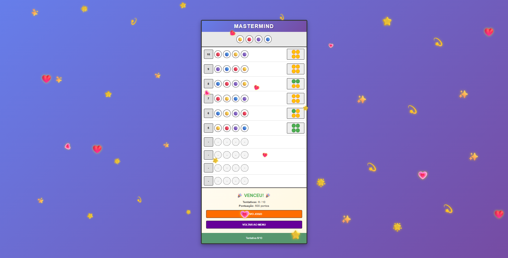

# **Mastermind — Case**

## **Visão Geral**
**Projeto:** Construção do jogo Mastermind (ou Senha no Brasil). 
**Infraestrutura:** Frontend em Angular, Backend em FastAPI (Python) e Banco de Dados em SQLite. 
**Arquitetura**: Controller -> Service -> Repository.  
**Autor**: Lucas Chaves Batista. 
**Linkedin**: https://www.linkedin.com/in/lucas-chaves-lcb/

## **Funcionalidades**
Este projeto implementa as funcionalidades principais abaixo:

- **Cadastro (Register):** Permite criar uma nova conta informando nome, email e senha. Validações básicas são aplicadas e a senha é armazenada de forma segura.

- **Login / Autenticação:** Autenticação via `POST /login` que retorna um token JWT (Bearer). O token deve ser incluído no cabeçalho `Authorization: Bearer <token>` para acessar rotas protegidas.

- **Ranking / Leaderboard:** Endpoint público que retorna os usuários com maior pontuação em ordem decrescente. É limitado o número de resultados em 10 (parâmetro `limit`).

- **Jogos (Criar / Jogar / Status):**
    - **Iniciar jogo:** cria uma nova sessão de jogo associada ao usuário autenticado.
    - **Realizar tentativa (guess):** submeter uma tentativa para o jogo (rota `POST /games/{game_id}/guess`). O backend responde com a análise da tentativa (cores corretas/posições corretas conforme regras do Mastermind).
    - **Status:** consultar estado do jogo (`GET /games/{game_id}`), histórico de tentativas e informações sobre conclusão/vitória.

- **Gerenciamento de usuário:** endpoints para alterar senha (`/users/change-password`), resetar pontuação (`/users/reset-score`) e deletar conta (`/users/{email}`) com validação de identidade. 
Apesar da existência, esses endpoints não estão acessíveis para o usuário. Serviram apenas para gerenciamento administrativo mesmo.

- **Logout:** rota para invalidar o token, limpar localStorage/Cookies e encerrar a sessão do usuário.

### **Banco de Dados**
SQLite persiste entidades principais: `users`, `games` e `guesses`.
- `users`: id, name, email (único), password_hash, score.
- `games`: id, user_id (FK), secret, status, attempts_made, max_attempts.

### **Como jogar (Resumo das regras):**
O jogo gera uma combinação secreta de cores que o jogador tenta adivinhar em 10 rodadas.

Em cada tentativa o jogador envia uma lista de 4 cores; o sistema responde indicando quantas cores estão corretas na posição exata (verde), quantas cores existem mas em posição diferente (amarelo), ou vazio caso elas não existam na senha.

O jogo termina quando o jogador acerta a combinação ou esgota o número máximo de tentativas configurado.

#### **Pontuação**

O Jogador é pontuado com base na quantidade de tentativas. 
- 1 tentativa: 1000 pontos;
- 2 tentativas: 900 pontos;
 ...
- 10 tentativas: 100 pontos;
- 0 pontos caso não acerte em 10 tentativas.

## **Requisitos**
- **Python:** 3.11+.
- **npm:** 11.12.0.
- **Node** 24.14.0.
- **Angular**: 21.2.3.

## **Inicialização Rápida (Windows)**
Na pasta raiz do projeto, execute o script abaixo. Este configura e abre os servidores (backend + frontend):

`
powershell .\start-servers.ps1
`

A execução do arquivo abre duas janelas do PowerShell:
  - FastAPI: `http://localhost:8000`  (Swagger: `http://localhost:8000/docs`)
  - Angular: `http://localhost:4200`

## **Execução manual do Backend**
1. Primeiro crie um ambiente virtual:

    `python -m venv backend`

2. Ative o venv:

    `backend\Scripts\Activate.ps1`  ou  `source backend\Scripts\activate`

3. Instale dependências e rode o servidor:

    `pip install -r backend/requirements.txt`

    `uvicorn controller.controller:app --reload`

  ## **Execução manual do Frontend**
1. Instale dependências (na pasta `frontend`):

    `cd frontend`

    `npm install`

2. Rode a aplicação Angular:

    `ng serve`

3. Acesse o frontend em `http://localhost:4200`.

## **Documentação da API (Swagger / OpenAPI)**
A documentação interativa (Swagger UI) está disponível em `http://localhost:8000/docs` quando o backend estiver rodando.

A especificação também está incluída no repositório em [backend/openapi.json](backend/openapi.json) — útil para leitura offline ou import em ferramentas como Postman/Insomnia.

## **Autenticação**
Muitos endpoints exigem autenticação por `Bearer token` (HTTP Bearer). Use a rota de `POST /login` para obter token e inclua no cabeçalho `Authorization: Bearer <token>` ao testar via Swagger ou Postman.

## **Testes (Backend)**
Os testes do backend estão em `backend/tests`. Para executá-los (com o venv ativado):

- **Testes integrados**:

    `cd backend` 
    `python -m pytest tests/ -v`

-  **Cobertura de testes**:

    `cd backend` 
    `python -m pytest --cov=. --cov-report=term-missing`

## **Testes (Frontend)**
Os testes do frontend estão em arquivos spec do angular e podem ser executados da seguinte forma:

- **Testes integrados**:

    `cd frontend` 
    `npm ci` 
    `npm test`

- **Cobertura de testes**:

    `cd frontend` 
    `npx ng test --watch=false --coverage`

## **Declaração de Ética no uso de Inteligência Artificial Generativa**
Este projeto utilizou ferramentas de Inteligência Artificial generativa (IAGen) como apoio auxiliar durante o desenvolvimento. A IAGen foi empregada nas seguintes atividades:

- Geração e sugestão de testes automatizados;
- Redação, formatação e melhoria de comentários no código;
- Elaboração, revisão e formatação da documentação;
- Suporte na identificação e na sugestão de resolução de bugs;
- Atuação como motor de busca e facilitador de informações para acelerar a busca por referências e exemplos.

O uso de IAGen neste repositório teve caráter estritamente assistivo. Todas as decisões finais de projeto, implementação e validação do conteúdo foram realizadas pelo autor humano. A autoria, integridade técnica e responsabilidade legal neste projeto cabem exclusivamente a mim, **Lucas Chaves Batista**.

